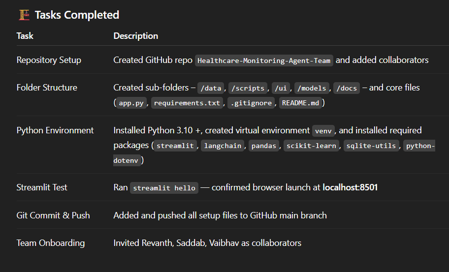

Day-1 Progress Report 
lead: Sayeed (me)
Objective for Day-1
Set up the complete project foundation and confirm Streamlit + Python environment runs successfully for all members.

 // hover on image.png to view work done 

Initial setup completed successfully. Environment verified and repository synced across all teammates.

Day 2 Progress Report – Streamlit UI Skeleton 
Lead: Revanth
Support: Sayeed
Objective: Design Streamlit UI skeleton with sidebar, dashboard, and placeholder sections.
 Tasks Completed

Sidebar navigation created

Dashboard, Medication, Fitness, and Health Tips placeholders added

Basic layout tested locally

App runs successfully using streamlit run app.py

Deliverable: Streamlit app runs locally with UI sections visible
Next Step (Day 3): Set up SQLite database and add medication reminder logic (Lead: Vaibhav)

 Day 3 Progress Report – Database Integration 

Lead: Vaibhav 
Support: Sayeed
 Objective

Set up SQLite database, define CRUD operations, and connect with Streamlit UI.

Completed Tasks

Added health_data.db with vitals & medication tables

Created scripts/db_operations.py with all DB functions

Integrated DB with app.py for testing

Verified data insertion & retrieval locally

 Deliverable:
Streamlit app runs with working database integration and can store test inputs.

Day-4 
lead:Sayeed Baig

Objective for Day-4
To research and test suitable public APIs for health and nutrition data integration into the Healthcare Monitoring AI Agent. The primary aim was to fetch live JSON data from at least one working API and document the implementation process.

Results / Output
Successfully fetched and stored real-world nutrition data without authentication, verifying the working API connection and saving a sample response for project reference. This data is ready for integration into the UI

Day-5
lead:Sayeed Baig

Objective for Day-5
To integrate the basic health data parsing logic, display basic fitness metrics from the SQLite database, and, in an enhanced step, integrate the API sample data from Day 4 into a new Streamlit UI section.

Proof of Progress
The Streamlit application now shows a new section, "Nutrition Insights," displaying parsed nutrition data from the OpenFoodFacts API sample, fulfilling the goal of making the Day 4 backend work visible on the UI.